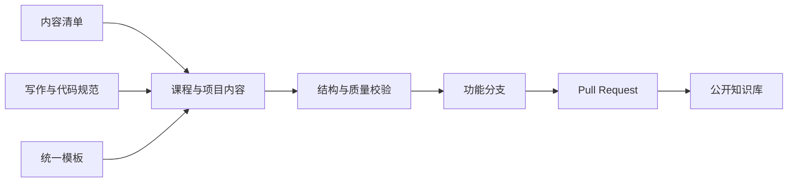

# AI Product Builder 知识库设计规格

## 1. 文档信息

- 项目名称：AI Product Builder
- 项目副标题：从零基础到独立开发商业级 AI 产品
- 面向读者：中文用户，默认不具备 AI Agent 开发经验
- 仓库地址：`longbao0210/AI_Product_Builder`
- 设计日期：2026-07-16
- 内容语言：简体中文；代码标识符、协议名、产品名保留官方英文
- 开源许可证：Apache License 2.0

## 2. 建设目标

本项目建设一个可公开发布、可持续维护、可验证质量的企业级开源知识库。学习者从计算机基础开始，依次掌握编程、Web、人工智能、大语言模型、Agent、产品工程、部署运营和商业化，最终能够独立设计、开发、测试、发布并运营商业级 AI 产品。

目标产品类型包括 AI Agent、AI SaaS、AI Tools、AI Workflow、AI 财富助手、AI 小程序、AI 网站、AI Browser Agent、AI Coding Agent、AI Voice Agent 与 AI 企业应用。

## 3. 设计原则

1. 中文优先：解释、案例、练习、项目说明和术语定义全部面向中文用户。
2. 渐进学习：知识依赖必须显式声明，章节从概念、案例逐步过渡到工程实践。
3. 内容即代码：Markdown、Mermaid、示例代码和清单均进入版本控制并接受自动校验。
4. 单一事实来源：目录清单、术语、模板和版本策略各自只有一个权威来源。
5. 可运行优先：Demo 必须具备运行命令、输入、预期输出、配置说明和最小测试。
6. 分批交付：每个批次形成可独立审查、可验证和可回滚的提交。
7. 长期维护：避免在正文硬编码容易过期的具体版本；版本下限和已验证版本集中维护。
8. 安全默认：所有凭据通过环境变量注入，示例不得包含真实密钥和敏感数据。

## 4. 总体架构

采用“内容仓库 + 统一规范 + 自动校验”的架构。Markdown 是课程内容的唯一来源；目录清单定义模块、项目和 Demo 的稳定编号；模板约束文档结构；校验脚本检查结构、链接、编号、术语、Mermaid 与示例完整性。

### 4.1 核心边界

- `docs/`：40 个编号课程模块，是系统化学习的主线。
- `projects/`：25 个编号商业项目，承载端到端产品实践。
- `examples/`：不少于 200 个可运行 Demo，承载单点技能验证。
- `learning-paths/`：30、90、180、365 天四套学习计划。
- `templates/`：学习、产品、工程和 Agent 开发模板。
- `standards/`：写作、术语、代码、Mermaid、命名和版本规范。
- `scripts/`：只负责生成索引与静态校验，不生成最终教学正文。
- `assets/`、`images/`、`diagrams/`：可复用视觉资产及其源文件。
- `prompts/`：可复用 Prompt 及评测说明。
- `checklists/`：学习、项目、发布和上线质量门禁。
- `resources/`：跨模块公共资源和官方资料索引。
- `.github/`：贡献模板、Issue 模板、Pull Request 模板和 CI 工作流。

## 5. 内容模型

### 5.1 课程模块

`docs/` 固定包含 `01-Computer-Fundamentals` 至 `40-Career`。每个模块至少包含以下文件：

1. `README.md`：模块入口、学习地图和章节导航。
2. `SUMMARY.md`：模块摘要和能力验收标准。
3. `Glossary.md`：模块术语表。
4. `Resources.md`：以官方一手资料为主的学习资源。
5. `FAQ.md`：高频问题及答案。
6. `Best-Practices.md`：可执行的最佳实践。
7. `Common-Mistakes.md`：错误表现、原因、诊断和修复。
8. `Exercises.md`：分级练习与验收标准。
9. `Projects.md`：模块项目及交付物。
10. `Interview.md`：面试题、解题思路和能力映射。

模块内教学章节使用两位数编号，例如 `01-How-Computers-Work.md`。章节数由知识边界决定，不为追求形式统一而强制相等。

### 5.2 统一章节模板

每个教学章节按以下顺序组织，不允许省略；无独立代码需求的基础概念章也要提供可观察或可验证的最小示例：

1. 标题
2. 学习目标
3. 为什么学
4. 适用场景
5. 核心概念
6. 生活案例
7. 工作案例
8. 理论
9. 流程图
10. 架构图
11. 时序图
12. 代码示例
13. Demo
14. 练习
15. 项目
16. 最佳实践
17. 常见错误
18. FAQ
19. 总结
20. 下一章

### 5.3 项目模型

`projects/` 固定包含 25 个项目，从 `01-AI-Chat` 到 `25-AI-SaaS`。每个项目至少包含产品说明、PRD、用户故事、系统设计、数据模型、API 设计、安全模型、测试策略、部署手册、运营指标、里程碑和根目录 README。实现代码按 `backend/`、`frontend/`、`infra/`、`tests/` 分区；仅在该项目确实需要相应分区时创建。

### 5.4 Demo 模型

Demo 使用三位数稳定编号 `001` 至 `200+`，按主题分组但编号不重复。每个完整 Demo 至少包含：

- 中文 `README.md`；
- 可复制的安装与运行命令；
- `.env.example` 或“不需要环境变量”的明确说明；
- 最小可运行源码；
- 确定性测试或可重复的人工验收步骤；
- 输入、输出和故障排查说明；
- 对应课程模块与项目的反向链接。

## 6. 编号与引用规则

1. 课程模块采用两位数编号，编号一经发布不得复用。
2. 商业项目采用两位数编号，与用户给定顺序保持一致。
3. Demo 采用三位数全局编号，不因目录调整而改变。
4. 内部链接全部使用相对路径；文件重命名必须同步更新反向链接。
5. “下一章”必须指向真实存在的下一编号章节；模块末章指向下一模块 README。
6. 跨模块前置知识使用固定模块名和相对链接，不使用“前面讲过”等模糊引用。

## 7. 术语与语言规范

全仓术语由 `standards/TERMINOLOGY.md` 管理。首次出现时使用“中文术语（英文全称，英文缩写）”，后续优先使用约定中文名或通行缩写。例如“大语言模型（Large Language Model，LLM）”。

`Agent` 统一写作“智能体（Agent）”；`Prompt` 统一写作“提示词（Prompt）”；`Embedding` 统一写作“嵌入（Embedding）”；`Tool Calling` 统一写作“工具调用（Tool Calling）”。代码、API 字段和官方产品名不翻译。

## 8. 技术与版本策略

- Python 示例要求 Python 3.13 或更高版本，并使用 `uv` 管理依赖。
- Python Web API 使用 FastAPI 与 Pydantic v2。
- Web 示例使用 React、TypeScript、Tailwind CSS 与 Next.js。
- 小程序示例使用 Taro，并覆盖微信小程序平台约束。
- 模型示例覆盖 OpenAI SDK、Claude SDK 与 Gemini SDK。
- 容器化示例使用 Docker。
- 依赖采用“兼容下限 + 锁文件已验证版本”策略。
- `standards/VERSIONS.md` 记录最近验证日期、运行时下限和各 Demo 锁定版本。
- 涉及“最新版本”的内容在进入对应模块前查阅官方文档并更新，不凭记忆硬编码。

## 9. 学习路径

项目提供 30、90、180、365 天四套计划。四套计划共享同一能力树，通过学习强度和项目深度区分：

- 30 天：建立全局认知，完成一个最小 AI 产品。
- 90 天：掌握核心全栈与 LLM 应用开发，完成三个可部署项目。
- 180 天：覆盖 Agent、RAG、工作流、部署和 SaaS，完成一个商业级主项目。
- 365 天：完成全部核心模块、代表项目和作品集，具备独立产品交付能力。

`LEARNING_PATH.md` 是总入口，具体日程位于 `learning-paths/`，避免在多处维护同一日程。

## 10. 交付批次

### 批次 0：设计基线

交付本设计规格并建立仓库分支与审查流程。

### 批次 1：企业级骨架与 01 模块

交付完整目录树、目录职责、全局 README、ROADMAP、LEARNING_PATH、CHANGELOG、CONTRIBUTING、LICENSE、行为准则、安全策略、统一规范、模板、清单、40 个模块的固定文件结构、25 个项目入口、200 个 Demo 清单，以及内容完整的 `01-Computer-Fundamentals`。

除 `01-Computer-Fundamentals` 外，首批模块入口只描述范围、依赖、章节规划和验收标准，不伪装成已经完成的教学正文。成熟度状态必须在索引中明确标注。

### 批次 2 至 40：课程模块

每批完成一个编号模块的全部教学章节、配套练习、项目、术语、FAQ、资源和面试内容，同时补充关联 Demo。

### 项目与 Demo 批次

项目在其前置课程完成后进入实现；Demo 随课程增量交付。最终验收要求 25 个项目规格完整且 Demo 总数不少于 200。

## 11. 质量保障

CI 至少执行以下检查：

1. 必需目录和文件完整性。
2. 模块、章节、项目和 Demo 编号唯一性及连续性。
3. Markdown 内部链接与锚点有效性。
4. 章节模板标题完整性与顺序。
5. Mermaid 代码块语法检查。
6. 禁止提交密钥、令牌和真实凭据。
7. Python 格式、静态检查与测试。
8. TypeScript 格式、类型检查与测试。
9. Demo 元数据、运行说明和反向链接完整性。
10. 术语禁用写法和占位符扫描。

内容允许使用 `计划中` 状态，但正文不得包含 `TBD`、`TODO`、空标题或伪造完成标记。

## 12. 错误处理与维护流程

- 内容错误通过 Issue 报告，并标注模块、文件、环境和复现步骤。
- 失效外链优先替换为官方稳定链接；暂时不可替换时记录检查日期和替代检索路径。
- SDK 破坏性更新先修改版本矩阵和独立 Demo，通过验证后再更新课程正文。
- 目录或术语迁移必须提供迁移说明，并由脚本检查旧引用是否清零。
- 涉及安全、合规、金融等高风险内容必须标注边界，引用权威来源，并明确其不构成专业建议。

## 13. Git 与发布流程

1. 默认分支为 `main`，禁止在本任务中直接写入。
2. 设计与内容在功能分支完成。
3. 提交信息遵循 Conventional Commits。
4. Pull Request 必须列出范围、验证命令、已知限制和后续批次。
5. 版本遵循语义化版本；内容骨架可发布 `0.x`，达到既定完整度后发布 `1.0.0`。
6. CHANGELOG 采用 Keep a Changelog 的中文化结构。

## 14. 首批验收标准

批次 1 只有同时满足以下条件才可标记完成：

- 仓库顶层结构与职责说明完整。
- 40 个课程模块均具备固定的 10 个文件和章节规划。
- `01-Computer-Fundamentals` 的全部规划章节遵循统一章节模板且内容完整。
- 25 个商业项目均有明确范围、依赖、里程碑和验收标准。
- 200+ Demo 具有唯一编号、主题、关联模块、技术栈与成熟度状态。
- 四套学习计划覆盖每天或每阶段的目标、实践和验收。
- 模板、规范、清单和贡献流程可直接使用。
- 本地质量脚本通过，Pull Request 清楚报告验证结果。

## 15. 明确不在首批范围内的内容

- 不在首批同时写完 40 个模块的全部正文。
- 不在首批实现 25 个项目的全部生产代码。
- 不在首批为所有 200+ Demo 提供完整实现；先建立可追踪清单，随后随模块实现。
- 不在首批引入独立文档站点框架；内容和质量体系稳定后再评估。
- 不宣称任何外部 SDK、法规、价格或模型能力永久最新。

这些边界用于保证每一批交付真实、可验证，并不改变最终完成全部知识库的目标。
